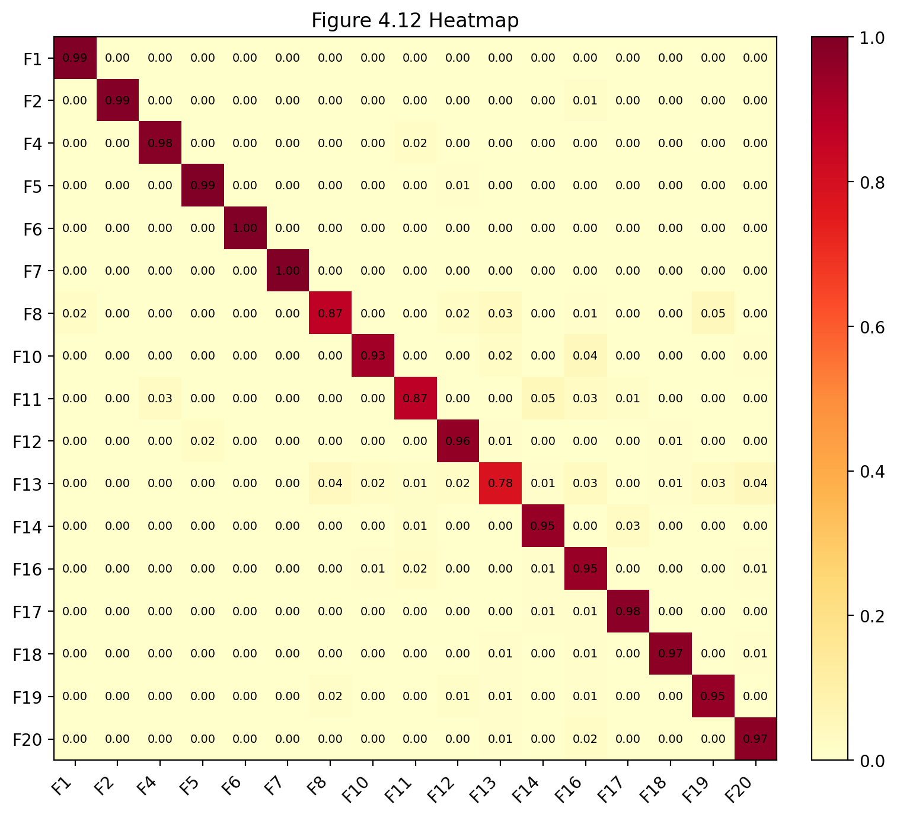

# 1 基于 Python 的降噪自编码器故障诊断仿真实现

## 1.1 TE 数据集说明

在本章中，仿照 `去噪自编码器py编程.docx` 中的实现过程，利用当前项目中的 Python 程序对田纳西-伊斯曼（TE）过程故障诊断进行仿真分析。本文所采用的数据集为 `CNN/data567.mat`，其中包含训练数据与测试数据。训练集样本选取 `d00_6` 至 `d20_6`，测试集样本则由 `d00_5` 至 `d20_5` 与 `d00_7` 至 `d20_7` 两组数据合并而成。

由于部分变量对本次仿真分析无意义，因此参照原文档中的处理方式，将原始 52 维数据中的第 46 列和第 50 列删除，从而得到 50 维输入变量。其 Python 实现见 [data.py](/C:/Coding/260311_matlab-to-py/te_dae/data.py)，程序如下：

```python
TRAIN_FAULT_IDS = [1, 2, 4, 5, 6, 7, 8, 10, 11, 12, 13, 14, 16, 17, 18, 19, 20]
ALL_IDS = list(range(21))
DROP_COLS = [45, 49]


def _select_features(array: np.ndarray) -> np.ndarray:
    keep = [idx for idx in range(array.shape[1]) if idx not in DROP_COLS]
    return array[:, keep].astype(np.float32)
```

训练集和测试集的选取方式如下：

```python
train_raw = {
    fault_id: _select_features(data[_fault_key("d", fault_id, "6")]) for fault_id in ALL_IDS
}

test_raw = {}
for fault_id in ALL_IDS:
    part_5 = _select_features(data[_fault_key("d", fault_id, "5")])
    part_7 = _select_features(data[_fault_key("d", fault_id, "7")])
    test_raw[fault_id] = np.vstack([part_5, part_7]).astype(np.float32)
```

由此可见，Python 版本在数据来源、样本划分方式以及输入维度处理方面，与原文档描述的实现思路是一致的。

## 1.2 仿真实现

在 Python 仿真过程中，本文按照原文档中的技术路线展开，即首先对 TE 数据进行标准化处理，然后添加噪声训练 DAE 模型，接着提取编码特征并再次标准化，最后将提取后的特征输入神经网络进行分类识别。整体实现步骤与 `去噪自编码器py编程.docx` 中给出的 MATLAB 仿真过程相对应。

### 1.2.1 数据标准化处理

在 TE 过程中，数据标准化是不可或缺的一部分。由于不同过程变量具有不同的量纲和数值范围，若直接将原始数据输入网络，容易使某些变量在训练过程中占据过大的影响权重，从而降低模型稳定性与识别效果。因此，本文与原文档一致，采用 z-score 标准化方法对数据进行预处理。

通常采取的标准化手段是 z-score 标准化，也称为标准差标准化。经过标准化后的数据，其均值接近于零，标准差接近于一，从而能够有效减小不同变量尺度差异对模型训练的不利影响。本文在标准化过程中，以正常工况 `d00` 的训练样本作为基准，先计算均值与标准差，再将其作用于全部训练数据和测试数据。该部分 Python 实现见 [data.py](/C:/Coding/260311_matlab-to-py/te_dae/data.py)，程序如下：

```python
base_mean = train_raw[0].mean(axis=0)
base_std = train_raw[0].std(axis=0, ddof=1)
base_std[base_std == 0] = 1.0

train_standardized = {
    fault_id: ((values - base_mean) / base_std).astype(np.float32)
    for fault_id, values in train_raw.items()
}
test_standardized = {
    fault_id: ((values - base_mean) / base_std).astype(np.float32)
    for fault_id, values in test_raw.items()
}
```

图 1.2 为未标准化处理的数据：


图 1.3 为标准化处理过的数据：


标准化处理完数据后，得到 `d00`、`d01`、`d02` 的标准化结果如下图所示。

图 1.4 `d00` 标准化数据：


图 1.5 `d01` 标准化数据：


图 1.6 `d02` 标准化数据：


综上所述，可以看出数据经过标准化后基本处于零值附近波动，说明标准化处理有效减小了原始数据之间的尺度差异。

### 1.2.2 添加噪声

在 DAE 模型训练过程中，通过向输入样本中加入噪声，可以提高数据的鲁棒性。所谓鲁棒性，是指模型对于噪声扰动的抵抗能力。DAE 的思想在于：通过学习带噪输入到无噪输出的映射关系，使网络能够更好地学习到数据本质特征，而不是过度依赖输入中的局部细节。

原文档采用 `sqrt(wuc) * randn(...)` 的形式向样本添加高斯噪声。当前 Python 程序对这一过程进行了等价实现，程序见 [data.py](/C:/Coding/260311_matlab-to-py/te_dae/data.py)，如下所示：

```python
def add_noise(data: np.ndarray, wuc: float, seed: int) -> np.ndarray:
    rng = np.random.default_rng(seed)
    noise = rng.normal(loc=0.0, scale=np.sqrt(wuc), size=data.shape)
    return (data + noise).astype(np.float32)
```

在本文最终实验中，噪声强度参数取 `wuc = 0.025`。实验表明，该噪声强度在整体准确率以及难分类故障识别效果之间取得了较好的平衡。

### 1.2.3 DAE 模型和特征提取

一、训练样本与正常样本建立网络模型并训练网络。

本文使用六层全连接降噪自编码器完成数据编码与重建，其编码部分将输入的 50 维特征映射到 40 维瓶颈特征，解码部分再将其恢复至原始输入维度。网络结构与原文档中的 DAE 思路保持一致，其 Python 实现见 [models.py](/C:/Coding/260311_matlab-to-py/te_dae/models.py)，部分程序如下：

```python
class DenoisingAutoencoder(nn.Module):
    def __init__(self, input_dim: int = 50) -> None:
        super().__init__()
        self.fc1 = nn.Linear(input_dim, 50)
        self.fc2 = nn.Linear(50, 45)
        self.fc3 = nn.Linear(45, 40)
        self.fc4 = nn.Linear(40, 45)
        self.fc5 = nn.Linear(45, 50)
        self.fc6 = nn.Linear(50, input_dim)
        self.act = nn.LeakyReLU()
```

DAE 训练参数设置如下：学习率为 `0.0001`，迭代次数为 `2500`，批次尺寸为 `32`。该部分调用程序见 [pipeline.py](/C:/Coding/260311_matlab-to-py/te_dae/pipeline.py)，如下所示：

```python
dae_history = train_autoencoder(
    dae_model,
    noisy_features=dae_train_noisy,
    clean_features=bundle.dae_train_data,
    epochs=args.dae_epochs,
    batch_size=32,
    learning_rate=args.dae_lr,
    device=device,
    log_interval=max(1, args.dae_epochs // 10),
)
```

二、训练数据放入网络模型进行预测。

DAE 训练完成后，需要将训练数据输入网络，提取编码特征。当前 Python 程序中保留了两种特征提取方式，以便与原文档中的“查看第 3 层特征”过程进行对照。相关程序见 [models.py](/C:/Coding/260311_matlab-to-py/te_dae/models.py)，如下所示：

```python
def extract_features(self, x: torch.Tensor, mode: str = "fc3_linear") -> torch.Tensor:
    if mode == "fc3_linear":
        return self.encode_fc3_linear(x)
    if mode == "bottleneck_relu":
        return self.encode(x)
    raise ValueError(f"Unsupported feature extraction mode: {mode}")
```

经过多轮实验对比，本文最终选取瓶颈层激活输出作为特征提取方式，因为该方式在综合准确率和关键故障识别效果方面更优。

将训练数据编码特征再次标准化的程序如下：

```python
d00_features = encoded_train[0]
feature_mean = d00_features.mean(axis=0)
feature_std = d00_features.std(axis=0, ddof=1)
feature_std[feature_std == 0] = 1.0
```

随后，程序使用上述统计量对全部编码特征进行第二次标准化处理。训练数据编码特征标准化结果如下图 1.7 所示：


三、将测试数据放入网络模型进行预测。

测试数据同样经过 DAE 编码与第二次标准化处理后，作为后续分类网络的输入。测试数据编码特征标准化结果如下图 1.8 所示：


四、将提取的训练数据和测试数据编码特征保存，并将保存的文件放入神经网络进行分类。

### 1.2.4 定义分类标签和训练神经网络

一、定义分类标签。

根据原文档中的分类设置，本文共定义 17 个故障类别，分别对应 `F1、F2、F4、F5、F6、F7、F8、F10、F11、F12、F13、F14、F16、F17、F18、F19、F20`。在 Python 程序中，故障编号与分类标签的映射关系见 [data.py](/C:/Coding/260311_matlab-to-py/te_dae/data.py)，程序如下：

```python
classifier_labels = {fault_id: index + 1 for index, fault_id in enumerate(TRAIN_FAULT_IDS)}
```

其中，第一个故障对应标签 1，第二个故障对应标签 2，第四个故障对应标签 3，依此类推，直到第二十个故障对应标签 17。数据标签可视化结果如下图 1.9 所示：


二、训练神经网络。

将从 DAE 中提取的训练数据编码特征输入神经网络进行训练。分类器采用三层全连接网络，其网络结构与原文档中的全连接分类网络相对应，相关程序见 [models.py](/C:/Coding/260311_matlab-to-py/te_dae/models.py)，如下所示：

```python
class ClassifierNet(nn.Module):
    def __init__(self, input_dim: int = 40, num_classes: int = 17) -> None:
        super().__init__()
        self.net = nn.Sequential(
            nn.Linear(input_dim, 400),
            nn.Tanh(),
            nn.Linear(400, 250),
            nn.Tanh(),
            nn.Linear(250, num_classes),
        )
```

在本文最终实验中，分类网络学习率设置为 `0.0002`，训练轮数设置为 `1000`。其训练调用程序见 [pipeline.py](/C:/Coding/260311_matlab-to-py/te_dae/pipeline.py)，如下所示：

```python
clf_history = train_classifier(
    classifier,
    features=clf_train_x,
    labels=clf_train_y,
    epochs=args.clf_epochs,
    batch_size=300,
    learning_rate=args.clf_lr,
    device=device,
    log_interval=max(1, args.clf_epochs // 10),
)
```

当前程序还会自动导出网络结构图与训练过程图，结果如下所示。

图 1.10 网络结构图：


图 1.11 训练过程：


三、测试网络。

测试阶段，程序将测试集编码特征输入训练好的分类网络，依次对各故障类别进行分类预测，并统计对应准确率。该部分程序见 [pipeline.py](/C:/Coding/260311_matlab-to-py/te_dae/pipeline.py)，核心代码如下：

```python
for fault_id in TRAIN_FAULT_IDS:
    count = min(_test_slice_count(fault_id), bundle.classifier_test_features[fault_id].shape[0])
    features = bundle.classifier_test_features[fault_id][:count]
    preds = predict_classes(classifier, features, device=device)
    label = bundle.classifier_labels[fault_id]
    fault_acc = float((preds == label).mean())
    per_fault_accuracy[f"F{fault_id}"] = fault_acc
```

四、计算准确率和热值图。

在完成故障分类后，程序进一步构造按行归一化的混淆矩阵，并绘制热值图，从而对分类结果进行可视化展示。其中主流程程序见 [pipeline.py](/C:/Coding/260311_matlab-to-py/te_dae/pipeline.py)，绘图程序见 [plotting.py](/C:/Coding/260311_matlab-to-py/te_dae/plotting.py)。

## 1.3 Python 仿真结果

运行程序后，可以得到网络结构图、训练过程图以及热值图。经过多轮参数搜索与结果对比，本文最终选取瓶颈层激活特征、随机种子 `42`、噪声强度 `0.025`、DAE 学习率 `0.0001`、分类器学习率 `0.0002`、分类器训练轮数 `1000` 作为当前 Python 版本的最优仿真配置。

对应指标文件为 [metrics_bottleneck_s42_w0025_clr2e4_ce1000.json](/C:/Coding/260311_matlab-to-py/report_assets/metrics_bottleneck_s42_w0025_clr2e4_ce1000.json)，热值图文件为 [figure_4_12_bottleneck_s42_w0025_clr2e4_ce1000.png](/C:/Coding/260311_matlab-to-py/report_assets/figure_4_12_bottleneck_s42_w0025_clr2e4_ce1000.png)。

根据结果文件可知，模型平均准确率为 `0.9495`。其中，`F1` 的准确率为 `0.9950`，`F2` 的准确率为 `0.9875`，`F4` 的准确率为 `0.9825`，`F5` 的准确率为 `0.9940`，`F6` 与 `F7` 的准确率均达到 `1.0000`。对于相对较难识别的故障类别，`F8` 的准确率为 `0.8670`，`F11` 的准确率为 `0.8730`，`F13` 的准确率为 `0.7830`。此外，`F14`、`F16` 和 `F20` 的准确率分别达到 `0.9525`、`0.9485` 和 `0.9705`。

从结果可以看出，随着分类训练轮数增加，模型准确率逐步提高，损失逐步降低。在本文最终配置下，多数故障类别已经取得较高识别精度，其中 `F1`、`F2`、`F4`、`F5`、`F6`、`F7` 等类别均表现较好；相对而言，`F8`、`F11` 与 `F13` 仍然属于较难识别的类别，但与项目早期实验结果相比，这三类故障的识别准确率已有明显提升。

当前最优模型得到的热值图如下图 1.12 所示：



从图中可以看出，热值主要集中在对角线附近，说明多数故障样本能够被正确识别；同时，部分非对角区域仍然存在一定热值分布，表明少数故障类别之间仍存在混淆现象，其中 `F8`、`F11` 和 `F13` 相关类别更为明显。

## 1.4 本章小结

在本章中，首先从 TE 过程数据中选取一部分样本作为训练集，另外两部分样本合并作为测试集，并删除第 46 列和第 50 列数据，使原始 52 维数据变为 50 维输入。随后，对训练数据和测试数据进行了 z-score 标准化处理，并在 DAE 训练阶段适度加入高斯噪声，以提高模型的鲁棒性和特征学习能力。

在此基础上，本文利用六层全连接降噪自编码器对数据进行了特征提取，并将提取后的编码特征再次标准化，随后输入三层全连接神经网络进行分类识别。最终，通过对噪声强度、随机种子、特征提取方式、分类器学习率和训练轮数等参数进行多轮实验比较，获得了当前 Python 版本的最优配置，即瓶颈层激活特征、随机种子 `42`、噪声强度 `0.025`、分类器学习率 `0.0002`、分类器训练轮数 `1000`。

在该配置下，模型平均准确率达到 `0.9495`，说明当前 Python 版本已经较好地复现了原文档中的主要实现过程，并在 TE 过程故障诊断任务上取得了较好的实验效果。因此，该结果可以作为本项目基于 Python 实现的降噪自编码器故障诊断仿真报告。
